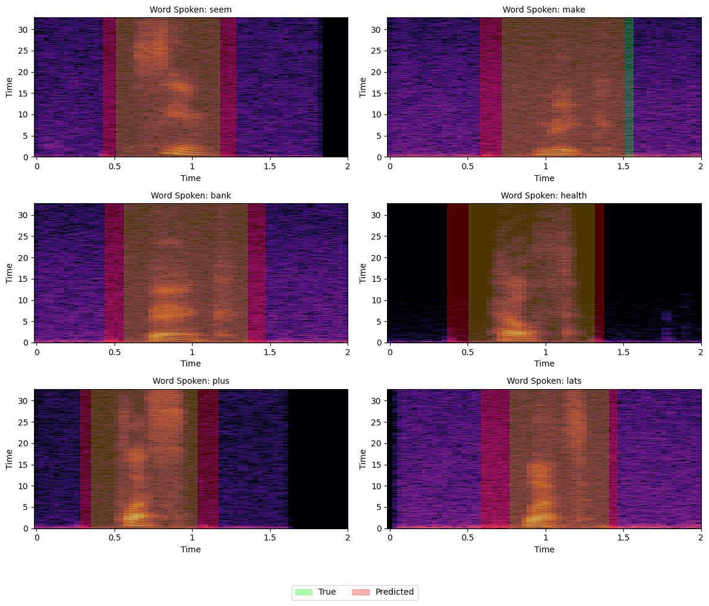

# Automatically locating word boundaries (for trimming in experimental studies)

*Spectrograms for various spoken words. In green, the word boundaries are shown. This would be used to trim the audio clips for experiment audios.*

*In this plot, the CNN-predicted boundaries are depicted in red.*

---

The goal of this project is to automatically find good time intervals to trim audios of spoken words. This is a surprisingly difficult task to solve using simple signal processing techniques, as audio data can be noisy, and language audio includes many subtle signals that are easy to miss. Theoretically, with the right amount of speech data and boundary labeling, this could be a relatively simple supervised ML problem that could be solved with audio processing and neural methods.

## Data
- Recordings of 200 one-syllable words (all spoken by me) with manually labeled time intervals denoting word boundaries
Augmented by creating modified copies (time shifting, time stretching, adding noise, etc.)
- Increased dataset size by a factor of 50 (10,000 samples total)
  
## Preprocessing
- Converts each audio signal (2 seconds of 16,000 Hz = 32,000 samples) into Log-Mel spectrogram (64 Mel bands x 200 windows)
  
## Neural network
- The model inputs the Log-Mel spectrogram data [64 x 200] and outputs two numbers, the start time and end time of the boundary.
- The model is structured as two 1D convolution and max pooling layers, then two dense layers to get the output.
- There are four components to the loss function:
  - MSE between predicted and true start/end times
  - Penalty for invalid windows (when start time > end time)
  - Penalty for when the predicted boundaries do not encapsulate the true boundaries (that is, when pred_start_time > true_start_time OR pred_end_time < true_start_time)
  - Penalty for wide boundaries (to balance the previous penalty)

## Results
- Predicted boundaries are close to true boundaries, and do capture speech information.
- Predicted boundaries typically do encapsulate true boundaries.
  - This is good– it means the NN is making conservative guesses, and maintaining important speech information. It is better for the guesses to be too long rather than too short.

## Limitations
- The data might not generalize to unseen data for the following reasons:
  - It only includes my voice.
  - The sound data is relatively not very noisy (at least, no sudden noises aside from speech)
  - All clips are 2 seconds, and the spoken word typically occurs between 0.5 and 1.5 seconds.
  - Only 200 words, all of which are one syllable.
  - No speech errors, like “um”s, stammers, or throat clears.
- To improve this model, I would need much more diverse data with different speakers, varying time lengths, adding realistic background noise, and including speech errors that might occur in a recording.
